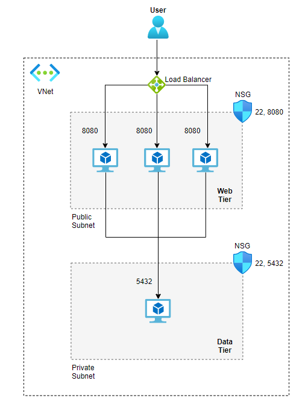

# Weight Tracker Infrastructure CI-CD


 This project shows how to create a CI-CD Pipeline for an infrastructure.

The requested infrastructure:




## Configuration

1. Creating remote backend for Terraform state storage.
2. Adding two yaml pipelines:  inftastructure-ci and inftastructure-cd
3. The the ci pipeline start **terraform init** and **terraform plan** for each workspace. Terraform plan will output plan files for each workspace **staging_plan_output** and **production_plan_output** . we can review the files before continuing to **Terraform apply**. 
To review the files:
```
terraform show filname
```
4. For workspace selection i used the TF_WORKSPACE variable azure deveops library.
5. The the CD pipeline start **Terraform apply** for each workspace. a manual approve is needed for each workspace after we review the infrastructure changes in the CI pipeline.
6. Ansible playbook **webserver_playbook.yml** will start from the CD pipeline to install webserver configuration for each workspace.


<!-- BEGIN_TF_DOCS -->
## Requirements

| Name | Version |
|------|---------|
| <a name="requirement_terraform"></a> [terraform](#requirement\_terraform) | >=0.12 |
| <a name="requirement_azurerm"></a> [azurerm](#requirement\_azurerm) | ~>2.0 |

## Providers

| Name | Version |
|------|---------|
| <a name="provider_azurerm"></a> [azurerm](#provider\_azurerm) | 2.99.0 |
| <a name="provider_local"></a> [local](#provider\_local) | 2.2.3 |

## Modules

| Name | Source | Version |
|------|--------|---------|
| <a name="module_postgres_server"></a> [postgres\_server](#module\_postgres\_server) | ./modules/postgres_db | n/a |
| <a name="module_server_load_balancer"></a> [server\_load\_balancer](#module\_server\_load\_balancer) | ./modules/load_balancer | n/a |
| <a name="module_servers_cluster"></a> [servers\_cluster](#module\_servers\_cluster) | ./modules/web_server | n/a |

## Resources

| Name | Type |
|------|------|
| [azurerm_nat_gateway.public_sub_nat_gateway](https://registry.terraform.io/providers/hashicorp/azurerm/latest/docs/resources/nat_gateway) | resource |
| [azurerm_nat_gateway_public_ip_association.gateway_public_ip_association](https://registry.terraform.io/providers/hashicorp/azurerm/latest/docs/resources/nat_gateway_public_ip_association) | resource |
| [azurerm_network_security_group.private_subnet_ngs](https://registry.terraform.io/providers/hashicorp/azurerm/latest/docs/resources/network_security_group) | resource |
| [azurerm_network_security_group.public_subnet_ngs](https://registry.terraform.io/providers/hashicorp/azurerm/latest/docs/resources/network_security_group) | resource |
| [azurerm_public_ip.nat_outbound_public_ip](https://registry.terraform.io/providers/hashicorp/azurerm/latest/docs/resources/public_ip) | resource |
| [azurerm_public_ip.web_srv_lb_ip](https://registry.terraform.io/providers/hashicorp/azurerm/latest/docs/resources/public_ip) | resource |
| [azurerm_resource_group.rg](https://registry.terraform.io/providers/hashicorp/azurerm/latest/docs/resources/resource_group) | resource |
| [azurerm_subnet.private_subnet](https://registry.terraform.io/providers/hashicorp/azurerm/latest/docs/resources/subnet) | resource |
| [azurerm_subnet.public_subnet](https://registry.terraform.io/providers/hashicorp/azurerm/latest/docs/resources/subnet) | resource |
| [azurerm_subnet_nat_gateway_association.sub_nat_association](https://registry.terraform.io/providers/hashicorp/azurerm/latest/docs/resources/subnet_nat_gateway_association) | resource |
| [azurerm_subnet_network_security_group_association.private-subnet-nsg-association](https://registry.terraform.io/providers/hashicorp/azurerm/latest/docs/resources/subnet_network_security_group_association) | resource |
| [azurerm_subnet_network_security_group_association.public-subnet-nsg-association](https://registry.terraform.io/providers/hashicorp/azurerm/latest/docs/resources/subnet_network_security_group_association) | resource |
| [azurerm_virtual_network.vnet](https://registry.terraform.io/providers/hashicorp/azurerm/latest/docs/resources/virtual_network) | resource |
| [local_file.ansible_host_vars](https://registry.terraform.io/providers/hashicorp/local/latest/docs/resources/file) | resource |
| [local_file.ansible_inventory](https://registry.terraform.io/providers/hashicorp/local/latest/docs/resources/file) | resource |
| [local_file.webservers_group_vars](https://registry.terraform.io/providers/hashicorp/local/latest/docs/resources/file) | resource |

## Inputs

| Name | Description | Type | Default | Required |
|------|-------------|------|---------|:--------:|
| <a name="input_db_name"></a> [db\_name](#input\_db\_name) | The name of postgres data base | `any` | n/a | yes |
| <a name="input_my_ip"></a> [my\_ip](#input\_my\_ip) | my ip address to allow for ssh firewall rule,set in variables.tfvars for security reasons. | `string` | n/a | yes |
| <a name="input_okta_client_id"></a> [okta\_client\_id](#input\_okta\_client\_id) | The client id for okta auth | `any` | n/a | yes |
| <a name="input_okta_secret"></a> [okta\_secret](#input\_okta\_secret) | The okta secret | `any` | n/a | yes |
| <a name="input_okta_url"></a> [okta\_url](#input\_okta\_url) | The the url for okta auth | `any` | n/a | yes |
| <a name="input_postgres_firewall_rule_end_ip"></a> [postgres\_firewall\_rule\_end\_ip](#input\_postgres\_firewall\_rule\_end\_ip) | The end ip address when allowing access to postgres through postgres firewall | `any` | n/a | yes |
| <a name="input_postgres_firewall_rule_start_ip"></a> [postgres\_firewall\_rule\_start\_ip](#input\_postgres\_firewall\_rule\_start\_ip) | The start ip address when allowing access to postgres through postgres firewall | `any` | n/a | yes |
| <a name="input_postgres_password"></a> [postgres\_password](#input\_postgres\_password) | postgres password set in variables.tfvars for security reasons. | `any` | n/a | yes |
| <a name="input_postgres_username"></a> [postgres\_username](#input\_postgres\_username) | postgres username set in variables.tfvars for security reasons. | `any` | n/a | yes |
| <a name="input_private_subnet_prefix"></a> [private\_subnet\_prefix](#input\_private\_subnet\_prefix) | Set a prefix for private subnet | `any` | n/a | yes |
| <a name="input_public_subnet_prefix"></a> [public\_subnet\_prefix](#input\_public\_subnet\_prefix) | Set a prefix for public subnet | `any` | n/a | yes |
| <a name="input_resource_group_location"></a> [resource\_group\_location](#input\_resource\_group\_location) | Location of the resource group. | `string` | `"eastus"` | no |
| <a name="input_resource_group_name"></a> [resource\_group\_name](#input\_resource\_group\_name) | name of the resource group. | `string` | `"weight-tracker-resource-group"` | no |
| <a name="input_server_count"></a> [server\_count](#input\_server\_count) | How many Servers to create. | `number` | `1` | no |
| <a name="input_vnet_address_space"></a> [vnet\_address\_space](#input\_vnet\_address\_space) | Address space for a vnet | `any` | n/a | yes |
| <a name="input_webserver_password"></a> [webserver\_password](#input\_webserver\_password) | Admin password set in variables.tfvars for security reasons. | `any` | n/a | yes |
| <a name="input_webserver_username"></a> [webserver\_username](#input\_webserver\_username) | Admin username set in variables.tfvars for security reasons. | `any` | n/a | yes |

## Outputs

| Name | Description |
|------|-------------|
| <a name="output_vms_password"></a> [vms\_password](#output\_vms\_password) | Use command - (terraform output  -json) to retrieve VMs password. |
<!-- END_TF_DOCS -->


